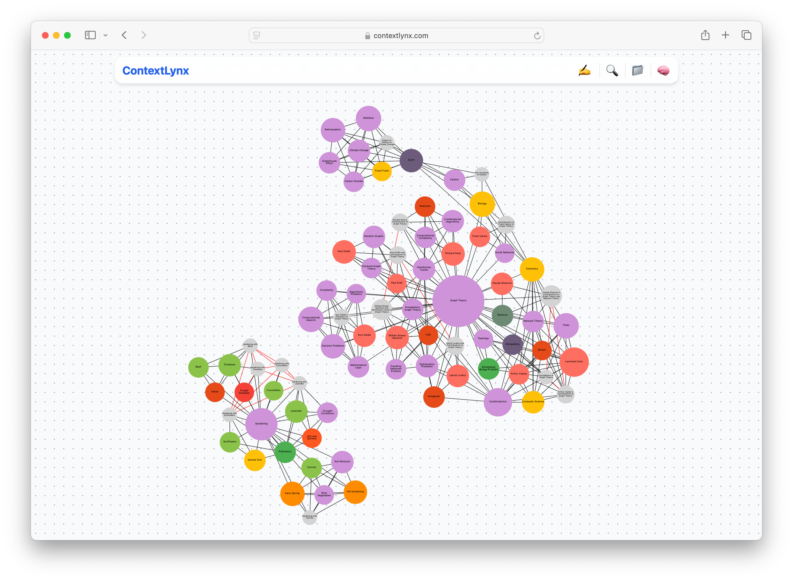
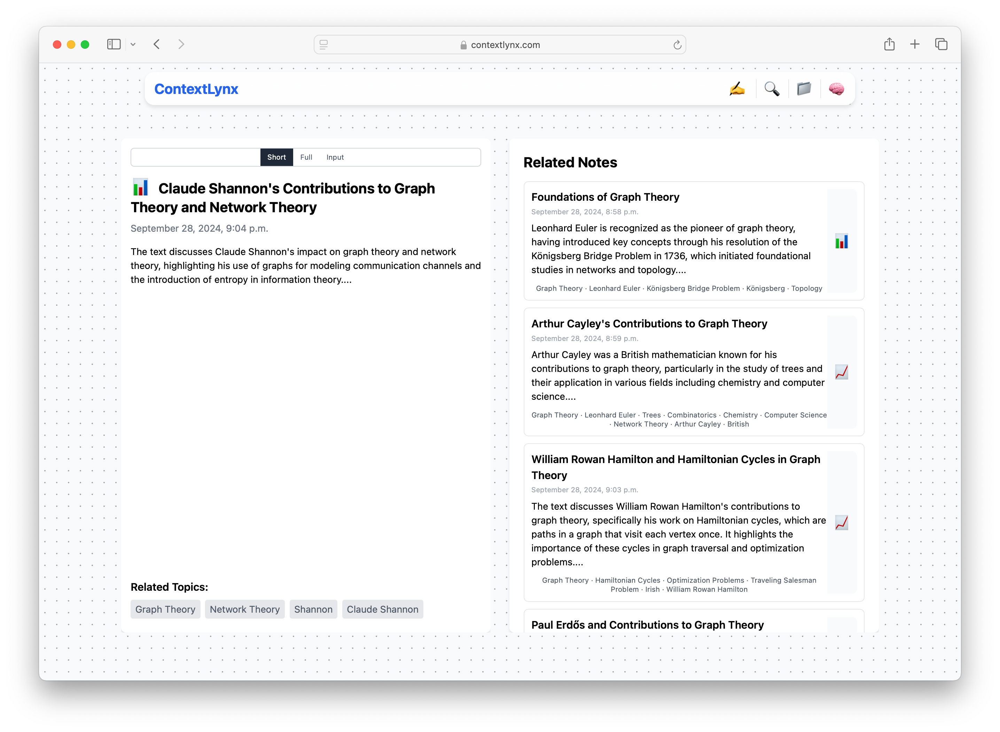
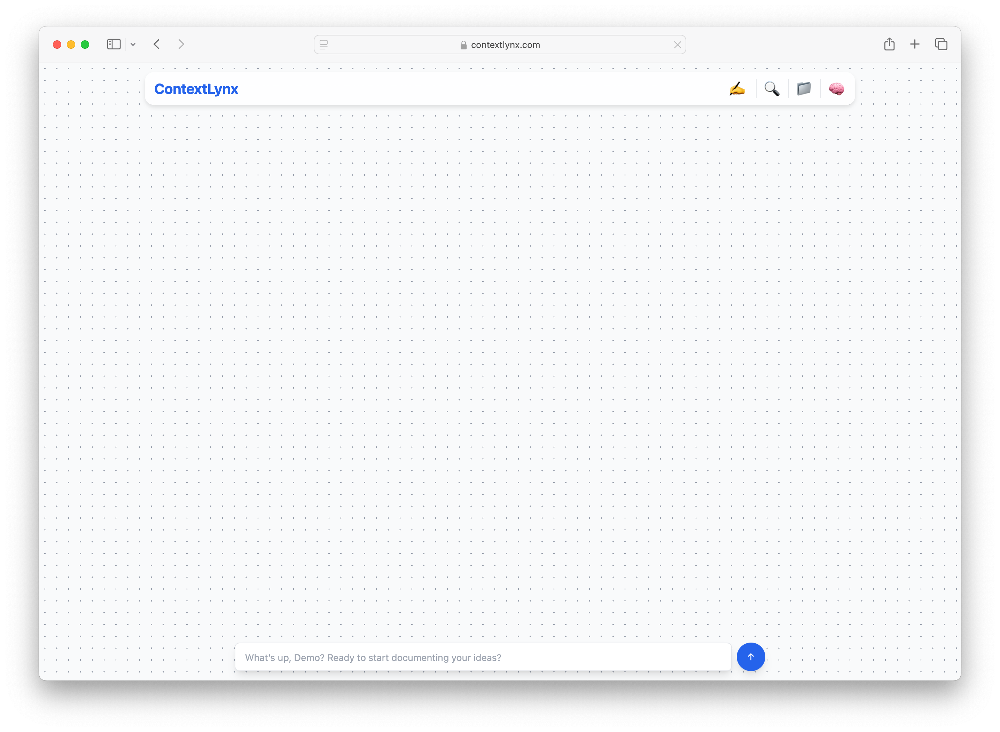
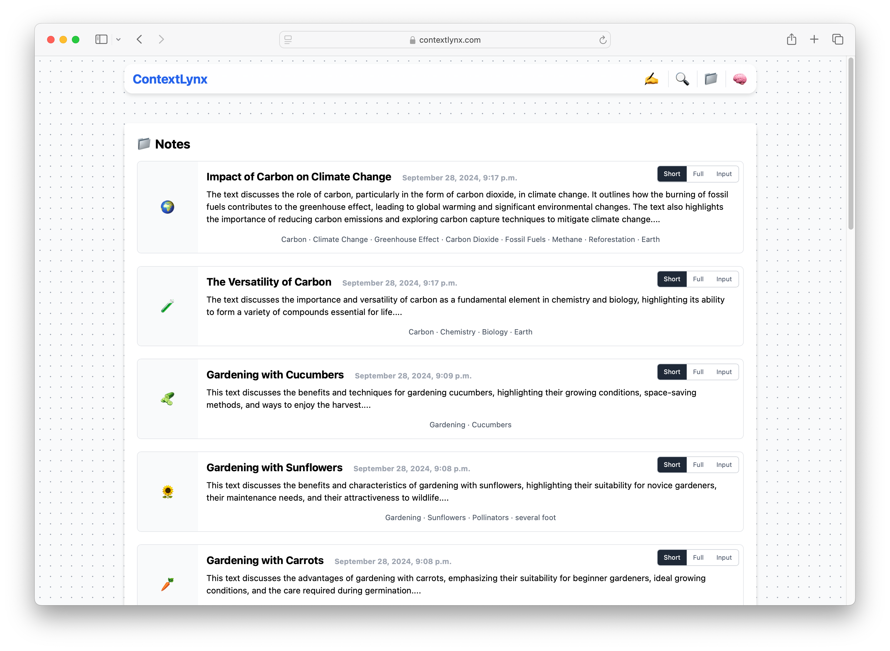

# ContextLynx

**ContextLynx** is a next-generation **Personal Knowledge Management (PKM)** tool designed to eliminate the need for manual categorization or tagging of notes. By leveraging advanced natural language processing techniques, ContextLynx organizes and connects your notes seamlessly through a dynamic knowledge graph. The application automatically detects relationships between your ideas, notes, and research topics, making your knowledge organization smarter and more intuitive. You can try out the service at [contextlynx.com/get-started](http://contextlynx.com/get-started).

## Prototype Features


- **Knowledge Graph**, with "real edges" represented in black and predicted edges in red. It is possible to click on any node to see related notes. Visualize your notes and their relationships in a knowledge graph, helping you explore topics holistically.


  


- **Semantic Note Taking**: Automatically detects connections between your notes using local models for Named Entity Recognition (NER) and word embeddings, alongside powerful large language models (LLMs) accessed via APIs.

- **Machine Learning Predictions**: Using node and graph embeddings (via **Node2Vec**), the app predicts which notes are likely to be connected based on the content.


- **Displaying related notes** to each note using the graph structure and KG Embeddings to predict edges. Notes predicted to be highly similar are directly connected through a virtual/predicted edge.  

  


- **Adding notes and information in a ChatGPT-like manner** or like a "saved messages thread" with automatic context linking (Context Lynx = Context Link). 


  

- **Supported Inputs**:
  - **Plain Text**: Write or import plain text notes.
  - **Web Links**: Automatically scrape and extract content from websites to capture information.
  - **YouTube Links**: Extract transcripts from YouTube videos to integrate their content into your knowledge graph. For the scope of the project, integrating a paid API for reliable transcript access was not included; in the worst case, only the link to the YouTube video will be added as a note.

- **Showing all notes ordered by creation date.**  

  
*Figure 4: List of all created Notes, a Note can be selected to show related notes*


## Technical Details

- **Backend**: Written entirely in Python, ContextLynx combines local machine learning models with API-based access to large LLMs for context generation. The application is built on the Django framework.

- **Graph Embeddings**: Utilizes Node2Vec for generating node/graph embeddings, enabling ML-driven predictions about note relationships.

- **Course Project**: This project was developed as part of the "Knowledge Graph" course at **TU Wien**.

## Deployment

You can try out ContextLynx live at [contextlynx.com/get-started](http://contextlynx.com/get-started).

### Dependencies
* Docker

### Local Deployment

To deploy ContextLynx locally, you'll need **Docker** installed on your machine. Follow these steps:

1. Clone the repository.
2. Copy the environment template file `.env.template` to `.env`:
   ```bash
   cp .env.template .env
   ```
3. The OpenAI API key is not included in the repository. You'll need to create your own API key by signing up and generating one at:
https://platform.openai.com/organization/api-keys
4. Start the service using Docker Compose:
   ```bash
   docker-compose up --build
   ```
5. Visit http://localhost:8000/get-started